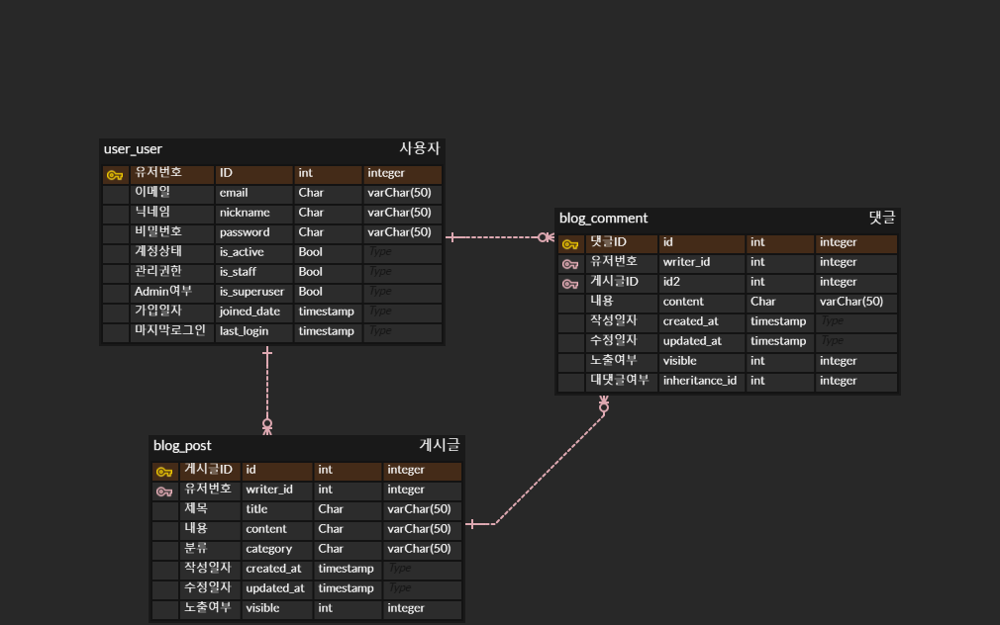

# BlogProjectV2

## 00. 개발 환경 및 기간
 - 개발환경  
 Django 4.2.3, HTML5, SQLite
 - 개발기간  
 2023.07.17 ~ 2023.07.20
 - 개발툴  
 VisualStudioCode 1.80.1  
 DB Browser for SQLite


## 구현기능
 1. User : 회원가입, 로그인
 2. Post : 게시글 CRUD
 3. Comment : 댓글 CRUD


## 모델 및 구조
 1. ERD  
 
 2. 파일구조
 django_tree.md

 3. URL
 ```
    ### 공용페이지
    "" : 인덱스(목록)

    ### 게시글
    "blog/write/" : 글 작성
    "blog/detail/<int:pk>/" : 글 상세
    "blog/detail/<int:pk>/edit/" : 글 수정
    "blog/detail/<int:pk>/delete/" : 글 삭제
    
    ### 댓글
    "blog/detail/<int:pk>/" : 댓글 작성
    "blog/detail/<int:pk>/" : 댓글 수정
    "blog/detail/<int:pk>/" : 댓글 삭제

    ### 회원
    "user/register/" : 회원가입
    "user/login/" : 로그인
 ```


## 회고
 - 발표자료를 만들며 일부 기능을 수정하던 중 csrf_token 에러로 화면캡쳐를 제대로 하지 못 함
 - 기능을 구현하는 과정에서 참고하는 코드 간의 model이나 상속받는 부분에서 구조파악을 충분히하지 않아 시간을 과도하게 잡아 먹은 부분이 아쉽지만 다음부터는 구조에 대한 최소한의 이해도를 갖고 가져가면서 Django에 대한 이해도를 채워가고 싶다는 욕심이 생겼습니다.
 - 지난 번 chatGPT 프로젝트에 이어 이번 개인프로젝트에서 개인적으로 바라는 정해놓은 목표만큼의 기능을 구현이 되지 않거나 풀리지 않는 문제로 인해 코드를 처음부터 작성하는 것을 반복하는 과정에서 시간이 아깝게 흘러간다는 생각이 들어 조금은 만드는 기능에 대해서 이미지를 조금 더 구체적인 계획을 세우는 습관을 들여야겠다는 생각을 하게됬습니다.

## 차후계획
 - 에러부분 해결 (인증 및 로그아웃)
 - 검색기능 추가
 - 게시글 목록의 정렬 순서 변경( 작성일자 기준 등으로 오름차순, 내림차순)
 - 이미지 등의 업로드
 - 게시글의 조회수
 - 인증권한 관련 예외처리
 - 좋아요 등의 아이콘 태그